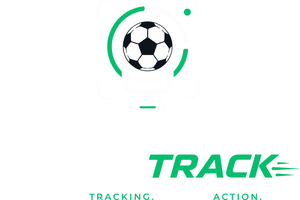
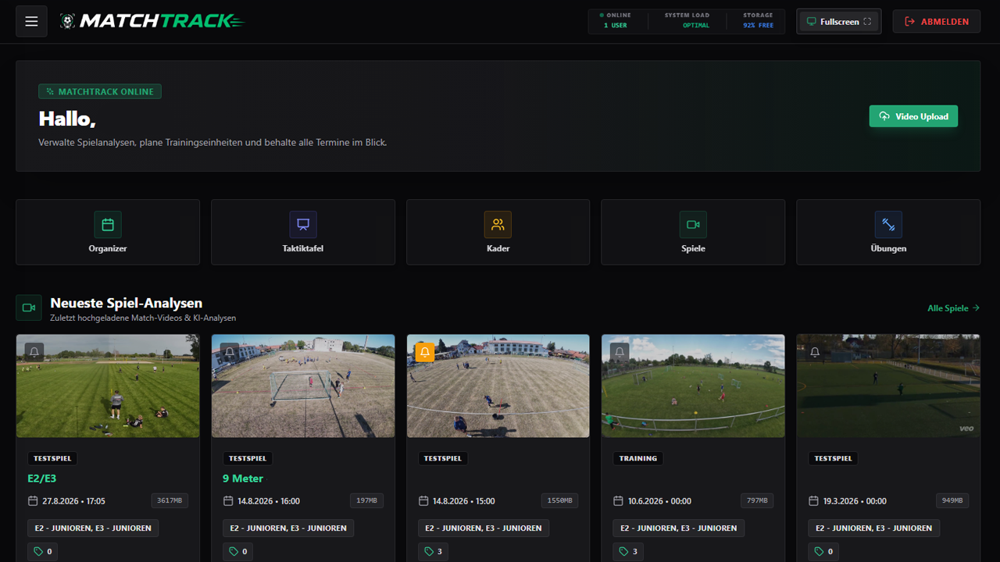
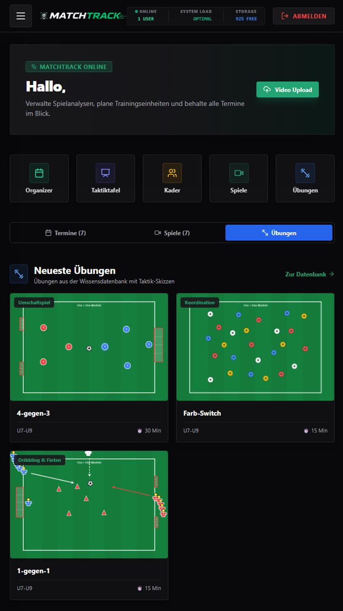

<p align="center">
  
</p>

<p align="center">
  <strong>Die moderne Open-Source Plattform für Fußball-Videoanalyse, Taktik & Team-Organisation.</strong>
</p>

<p align="center">
  
  
  
  
  
  
  
</p>

---

## 🌟 Übersicht & Vorschau

MatchTrack Online verbindet professionelle Videospielanalyse mit einfacher Teamorganisation. Entwickelt für Trainer, Analysten und Vereine, die ihre Spiele ohne teure Abo-Modelle auf eigener Infrastruktur (VPS oder lokal) analysieren möchten.

<p align="center">
  
</p>

<table align="center" width="100%">
  <tr>
    <td width="60%" valign="top">
      <h3>🚀 Highlights auf einen Blick</h3>
      <ul>
        <li><strong>Dual-Video-Perspektiven:</strong> Standard- und Panorama-Videos synchron abspielen und im Player frei umschalten.</li>
        <li><strong>KI-Laufweg-Heatmaps (YOLOv8):</strong> Automatisches Spielertracking und Laufwege-Visualisierung ohne manuelle Markierung.</li>
        <li><strong>@-Mentions für Spieler:</strong> Szenenkommentare mit Spielern verknüpfen – erscheint automatisch in deren Profil.</li>
        <li><strong>Taktikboard & Squad Drawer:</strong> Interaktive Taktiktafel für Mannschaftsbesprechungen mit Aufstellungsexport.</li>
        <li><strong>Trainer-Organizer:</strong> Spielpläne via fussball.de importieren, Anwesenheiten erfassen und Termine planen.</li>
        <li><strong>Smart Sharing & Passwortablauf:</strong> Spielzugriff mit Ablaufzeitpunkt für externe Gäste teilen.</li>
      </ul>
    </td>
    <td width="40%" align="center" valign="middle">
      
      <br />
      <em>📱 Vollwertige Mobile PWA App</em>
    </td>
  </tr>
</table>

---

## ⚡ Kernfunktionen

### 📹 Videoanalyse & Dual-Streaming
* **Multi-Stream Player:** Gleichzeitige Bereitstellung von **Standard-** (`📹 STD`) und **Panorama/Breitbild-** (`🏟️ PANO`) Videospuren mit synchronisierter Abspielposition (`currentTimeMs`).
* **Selektiver Spuraustausch:** Tausche oder ergänze einzelne Videospuren, ohne dass bestehende Notizen, Zeitstempel oder Zeichnungen verloren gehen.
* **Adaptives HLS-Streaming (ABR):** Automatische Skalierung (1080p, 720p, 480p) für flüssige Wiedergabe auch bei schwacher Mobilfunkverbindung.
* **Taktisches Zeichnen:** Pfeile, Zonen, Kreise und Freihandzeichnungen direkt auf Standbildern anfertigen und speichern.
* **Farbanpassungen & Fisheye:** Live-Regler für Helligkeit, Kontrast, Sättigung sowie Korrektur von Objektivkrümmungen.

### 🤖 KI-Erkennung & Spielerprofile
* **KI-Highlights & Heatmaps:** GPU-/CPU-Worker erkennt automatisch spielrelevante Szenen (Tore, Ecken, Karten) und generiert Heatmaps via YOLOv8.
* **Spieler-Mentions:** Durch Eingabe von `@` im Kommentarfeld können Spieler markiert werden. Die Szene wird sofort im Spielerprofil unter *Video-Szenen* verlinkt.
* **Kader- & Anwesenheitsmanagement:** Schnelle Anwesenheitserfassung für Training und Spiele, DFB.net-CSV-Import und PDF-Export.

### 📋 Taktik & Training
* **Interaktives Taktikboard:** Aufstellungen, Spielsysteme, Animationen, Pfeile und Laufwege auf einem dynamischen Spielfeld vorbereiten.
* **Übungs- & Trainingsdatenbank:** FT-Graphics Skizzen-Editor für Trainingsübungen inkl. Zeitkontrolle und Schwerpunktfiltern.

### 🔒 Sicherheit & Berechtigungen
* **Rollenbasiertes Rechtesystem:** Flexible Abstufung für *Viewer*, *Trainer*, *TeamAdmin* und *Admin*.
* **Gäste-Freigabe mit Ablaufdatum:** Teile Spiele per Passwort mit zeitlicher Befristung (z. B. 24h, 7 Tage, 30 Tage). Gäste erhalten eine fokussierte Vollbild-Ansicht ohne interne Trainer-Werkzeuge.

---

## 🛠️ Technologie-Stack

| Schicht | Technologie | Beschreibung |
| :--- | :--- | :--- |
| **Frontend** | [Next.js 14](https://nextjs.org/) (React 18) | App Router, Server Components & React.memo Optimierungen |
| **Styling & UI** | [TailwindCSS](https://tailwindcss.com/) & [Lucide Icons](https://lucide.dev/) | Modernes, responsives Dark-Theme für Desktop & Mobile |
| **Video & Stream** | [Hls.js](https://github.com/video-dev/hls.js/) & HTML5 Canvas | Adaptive Bitrate Streaming, Hardware-beschleunigtes Zeichnen |
| **Backend API** | [FastAPI](https://fastapi.tiangolo.com/) (Python 3.10+) | Asynchrones High-Performance REST API Gateway |
| **Datenbank** | [SQLAlchemy](https://www.sqlalchemy.org/) ORM | Unterstützt SQLite3 (Zero-Config) und MySQL / MariaDB |
| **KI / Computer Vision** | [Ultralytics YOLOv8](https://github.com/ultralytics/ultralytics) & [OpenCV](https://opencv.org/) | Spielertracking, Heatmaps & Szenenerkennung |
| **PWA & Mobile** | Service Worker, Background Sync | Vollwertige Installation auf iOS, Android, Windows & macOS |

---

## 🚀 Schnellstart & Installation

### Option 1: Lokale Installation (Entwicklung & Tests)
```bash
# 1. Repository klonen
git clone https://github.com/soko-grafik/MatchTrackOnline-Release.git
cd MatchTrackOnline-Release

# 2. Backend starten
cd backend
python -m venv venv
source venv/bin/activate  # Windows: venv\Scripts\activate
pip install -r requirements.txt
uvicorn main:app --reload --port 8000

# 3. Frontend starten (in neuem Terminal)
cd ../web
npm install
npm run dev
```
Öffne [http://localhost:3000](http://localhost:3000) im Browser.

---

### Option 2: Linux VPS / Server Deployment
Für den Produktivbetrieb mit Nginx, PM2 und Systemd steht eine ausführliche Schritt-für-Schritt-Anleitung bereit:

📖 **[Ausführliche Server-Installationsanleitung (VPS)](./docs/install_guide.md)**

---

## 📚 Dokumentation

Alle Detailanleitungen findest du im Ordner [`docs/`](./docs):

* 📘 **[Benutzerhandbuch (User Guide)](./docs/user_guide.md)** – Anleitung zu Videoanalyse, Taktikboard, Organizer & Rollen
* ⚙️ **[Systemanforderungen](./docs/requirements.md)** – Hardware- und VPS-Spezifikationen
* 🖥️ **[Lokales Setup](./docs/local_install_guide.md)** – Anleitung für Windows, macOS und Linux
* 🌐 **[VPS & Production Deployment](./docs/install_guide.md)** – Nginx, PM2 & Systemd Konfiguration

---

## ☕ Support & Spenden

**MatchTrack Online** ist ein unabhängiges Projekt, das mit viel Herzblut für Trainer und Vereine entwickelt wird. Der Betrieb von Testservern, die Bereitstellung von Updates und die kontinuierliche Entwicklung neuer Funktionen erfordern jedoch viel Zeit und laufende Ressourcen.

Wenn dir die Plattform bei deiner Videoanalyse, Spielvorbereitung und Trainingsarbeit hilft und du die Weiterentwicklung unterstützen möchtest, freue ich mich riesig über deine Unterstützung und einen Kaffee!

<p align="center">
  <a href="https://ppaypal.me/soko21061983" target="_blank">
    
  </a>
  &nbsp;&nbsp;
  <a href="https://paypal.me/soko21061983" target="_blank">
    
  </a>
</p>

---

<p align="center">
  Made with ⚽ for coaches and teams.
</p>

